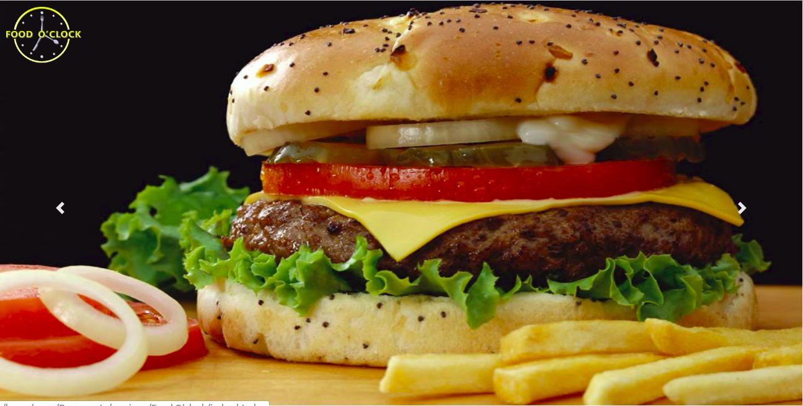

# Food O'clock

#### Check out Food O'clock [here](https://macymuhia.github.io/Food-O-clock/)

Last modified 21st June 2019.
#### By **Mercy Muhia**, **Jenniffer Nyawira**, **Melisa Juma**, **Oliver Muriithi** and **Rahma Osman**
## Description
Food O'clock is a web Application that gives a user ability to:
* order food online for either delivery or take-away
* reserve a table in case they want to dine in
## Project Behaviour
* A user can view all restaurants that have signed up with Food O’clock
* A user can view restaurants in category of choice
* A user can select restaurant and order a meal plus reserve a table
* A user can get total cost and get a QR code for their order to act as their bill

 
## Setup/Installation Requirements
* Git clone https://github.com/macymuhia/Food-O-clock.git
* cd Food O'clock
* open index.html file on your preferred browser
## Technologies Used
HTML, CSS (Bootstrap) and Javascript(JQUERY)
## Support and contact details
To contribute, submit a pull request. 
For questions or concerns, reach out on foodoclock@gmail.com
### License
*MIT*

### &copy; 2019 Food O'clock

